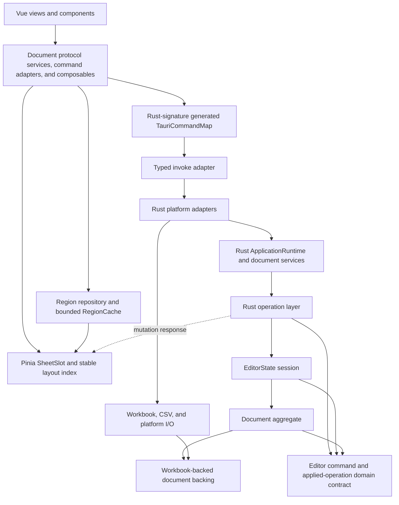

# Architecture

Simple Table is a single-document Tauri application. Rust owns the canonical
document; Vue owns a renderable projection and transient UI state.

## Component Boundaries



Frontend platform adapters select desktop, Android, or iOS file operations.
Business mutations remain platform-independent and go through the common Rust
operation layer.
Frontend component barrels are public package entry points for external
consumers. Components inside the same package import siblings directly, so an
entry point cannot form a cycle through one of the modules it exports.
Architecture checks parse TypeScript and Vue scripts into one resolved module
graph. Store and application boundaries are enforced over transitive reachability,
with the full dependency path reported for an indirect violation; production
frontend modules must also remain acyclic.
Rust production references are likewise resolved into a file-level module graph.
The application layer cannot reach the runtime, adapters, commands, I/O, or
recent-file infrastructure directly or through an intermediate module. Any
dependency cycle involving the application layer, an adapter, the backend
composition root, the document aggregate, or I/O fails the architecture check.

Tauri command modules are transport adapters. They own bounded wire
deserialization and executor selection, then delegate to application services
or outer adapters. They cannot import platform I/O or update implementations,
acquire the active-document registry, or invoke `ops` directly.
The command surface is separated by use case into file, document-query,
editor-mutation, search, and recent-file modules. Bounded cell input
deserialization lives in a command-private input module; command use-case
modules do not invoke one another.
Document replacement and close coordination live in the Rust application
layer, which owns retirement of mutation replay and search-index work before
releasing the old document. Neither the document model nor the I/O layer may
depend on command modules.

`CommandExecutionRuntime` is a second Tauri-managed composition object for
transport admission. It explicitly owns file, mutation, projection, query,
search, and recent-file executors over one shared process budget. Locking
document queries are asynchronous command adapters and use the bounded query
executor rather than running on a Tauri async-runtime thread. An execution
permit covers both the internal operation and outward DTO projection, including
exact serialized-byte admission. Command executors cannot be located through
static `OnceLock` values.

The top-level `runtime` module owns `ApplicationRuntime`, the backend composition
root managed by Tauri. It is deliberately outside the `application` module and
constructs narrow document-query, document-open, document-lifecycle,
document-save, editor-mutation, and search-query services over shared
repositories and coordinators. It owns outer recent, file, and search adapters; concrete platform
runtimes are private fields of those adapters and are not exposed to commands.
Application services declare only their actual dependencies and cannot import
the complete runtime, `AppHandle`, adapters, or I/O implementations. Commands
may receive `tauri::State<ApplicationRuntime>` and
`tauri::State<CommandExecutionRuntime>`, but select a narrow service, outer
adapter, and executor before delegating work. Business repositories,
schedulers, and command executors cannot locate process-global mutable state.
Repository-backed search document access is an outer adapter assembled by the
composition root. `search_service` contains only the port-driven use case and
cannot depend on the active-document repository or `DocumentHandle`. The
runtime exposes that query service independently; `EditorCommandService` owns
only mutation replay, mutation execution, and post-mutation index maintenance.
Search query and index ports exchange internal `SearchScope`, `SearchHit`, and
`SearchOutcome` values rather than RPC responses. Search infrastructure
enforces semantic result and memory budgets. The outward protocol projection
performs final `SearchResponse` mapping and exact serialized-byte admission at
the command boundary.

The active-document registry is hidden behind `ActiveDocumentRepository`.
Application and operation modules request semantic read or mutation handles
from the repository; they cannot acquire its `RwLock` directly. Search
infrastructure receives only `SearchDocumentSourcePort`, whose operations
return version-checked metadata, admitted full-Sheet text snapshots, or bounded
scan chunks. It cannot receive the concrete repository.
Document replacement uses an RAII repository transaction that releases an
unfinished replacement lease on drop.

Document opening is split between outer platform adapters and application
orchestration. Platform modules consume authorization and return
`OpenFileInput`; the outer adapter maps that value to `OpenDocumentSource`.
The application open service owns parse reservations and prepared-document
insertion, while an injected `DocumentCodecPort` owns format preflight, parsing,
and `EditorState` construction. The opaque decode plan retains validated codec
preflight state so XLSX archives are not scanned twice. Mobile prepared-source
adoption is injected as a semantic lifecycle port at the composition root. The
application query service only coordinates consistent repository reads.
Manifest, region, and session assembly lives in `document_projection`, which
returns serialization-independent values from `projection_model`. Exact wire
response limits and all DTO construction live in the top-level
`protocol_projection` module at the command boundary. Native-save capability
policy lives in `document_format_policy`, while pure file-format policy lives in
the top-level `document_format` module. Application production modules cannot
import `io` or adapters; application and operation modules
cannot import protocol DTOs or the outward protocol mapper. The I/O layer cannot
depend on `application`, `commands`, `ops`, or `state`.
Platform I/O returns serialization-independent file selections and byte inputs;
it cannot import RPC DTOs or the recent-file repository. Recent-file identifier
resolution belongs to the outer file adapter, and the command boundary maps
internal selections to desktop or mobile response DTOs.

`domain::editor_operation` owns the editor command vocabulary, canonical
applied operations, and their lightweight impact/projection views. Domain
cell-address parsing lives beside that vocabulary. Cross-layer resource policy
lives in the top-level `resource_limits` module so document, application, and
I/O adapters can enforce the same rules without depending on one another. The
state session and document model depend on the domain contract directly; they
must not depend on the operation-handler layer. `ops` may depend on both the
domain contract and state session to implement a use case, never the reverse.

Core cell values and text parsing belong to `domain::cell_value`. Wire edit
requests such as `SetCellRequest` belong to `types::editor_command` and are
mapped to `CellEditInput` at the application boundary. Domain commands cannot
depend on serde/JSON values, RPC requests, mutation responses, patches,
TypeScript generation, or Tauri types. `CellNumber` admits only finite integer
or floating-point values; the wire serializer alone maps those values to JSON.
`MutationIntent` is the single application mutation vocabulary: undo, redo, or
execution of the domain-owned `EditorCommand`. The same owned intent is first
hashed with explicit fixed-width and length-prefixed fields and then passed
unchanged to the executor. The replay coordinator owns only reservations and
cached outcomes; it cannot reconstruct commands or define a parallel identity
enum. Application replay and editor-command services cannot use serde or JSON
to define idempotency, so wire format changes cannot alter request identity.
A new-Sheet operation carries only domain initialization data;
projection and workbook adapters construct their own representations.
Formula diagnostics and runtime status, workbook and Sheet capabilities,
history status, and region metadata are also internal semantic models. The
document, formula, and state modules cannot import `types`. The top-level
`projection_model` module owns serialization-independent application snapshots
and mutation outcomes. The top-level `protocol_projection` module is their
explicit outward wire mapper. Its document, editor, search, file, and update
submodules map only their own feature, while shared cell, status, and response-size
helpers remain dependency leaves. Serde and TypeScript DTO changes cannot
propagate into the document aggregate, operation handlers, or application
services.

The Rust `document` module is the physical aggregate boundary. It owns
`SpreadsheetDocument`, transactions, mementos, formula coordination, save
snapshots, region metadata, and the concrete workbook backing that participates
in those invariants. Format-specific backing code is isolated under
`document::backing`. The aggregate declares `WorkbookBackingPort` for projection
refresh, consistency checks, cell writes, Sheet synchronization, and layout-unit
conversion. The I/O projection codec implements that port; no production module
under `document` may import `io`.
Operation commit and rollback are private `SpreadsheetDocument` behavior rather
than a sibling module that reaches back into the aggregate. Shared workbook patch
shapes and diagnostics live in a neutral backing contract, so the document body
may delegate to workbook state without workbook state depending on the body.
Undo and redo restoration are private `EditorState` behavior: document restore,
rollback, history movement, dirty/resource refresh, and revision advancement are
committed by the session aggregate rather than a sibling transaction object.
Canonical editable content lives in the serialization-independent
`document_data::DocumentData` and `DocumentSheet` model. These types have no
`serde` or `ts-rs` implementation and are not emitted to TypeScript. Merge,
extent, cell-format, style, hyperlink, drawing, and freeze-pane values in that
aggregate are internal semantic values rather than aliases of protocol DTOs.
The application projection layer maps canonical content into manifests, bounded
regions, and mutation patches; the Rust protocol module cannot expose or own a
complete canonical document aggregate.
`SpreadsheetDocument` and `EditorState` production constructors receive either
plain document data or an already assembled backing and never expose the
third-party workbook type. `state` owns the active editor session and may depend
on `document`, but neither `state` nor `ops` may import `io` directly. The `io`
module owns codecs, input limits, filesystem/platform adapters, and byte-level
file generation. Its projection mapper owns worksheet-to-document conversion and
consistency mapping. File readers and the `WorkbookBackingPort` adapter depend on
that mapper independently; the mapper does not call back into readers or writers.

Document execution returns internal `AppliedOperation`, `DocumentCellChange`,
and `DocumentRestoreChange` values. The document, formula, memento, and state
layers cannot construct mutation protocol DTOs. `ops::patch_projector` maps
operation effects to internal `MutationOutcome` and `MutationPatch` values;
`protocol_projection` is the only mapper from those outcomes to
`EditorMutationResponse`, `SheetCellChange`, and `EditorPatch` wire values.

Rust `types` is a runtime-independent protocol boundary. Session DTOs such as
`EditorSessionInfo`, `EditorStateInfo`, and `HistoryStatus` live there rather
than in `state`. Its display projection is an internal wire serializer; the
module cannot depend on application, state, operations, or I/O modules. Wire cell
values are owned wrappers around domain cell values; JSON and TypeScript behavior
is implemented on those wrappers and never globally attached to the domain type.
Protocol DTOs are split into dependency-ordered `cell`, `cell_change`,
`capabilities`, `document`, `editor_session`, `file`, and `mutation` modules.
Modules inside `types` import sibling modules directly instead of resolving
types through the root re-export facade, so the production dependency graph can
observe and reject protocol cycles.
Recent-file RPC requests and responses live in `types::recent` as well. The
serialization-independent `recent::model` owns the runtime record and tracking
input, while `recent::store` privately owns the persisted JSON schema.
`protocol_projection::recent` is the only mapper between those semantic values
and RPC DTOs, so persisted metadata migrations and wire-contract changes remain
independent.
All production Rust modules participate in the architecture dependency graph and
module cycles are rejected regardless of which feature contains them.

Save and export orchestration live in `application::document_save_service`.
That service owns revision validation, save leases, state commit, and post-save
index scheduling. Open preparation and save admission use one runtime-owned
`DocumentWorkBudgetPort`. Optional save reparse uses a preflight decode plan
from the same `DocumentCodecPort` used by open.
Byte generation is a separate `DocumentEncodePort`; the document save snapshot
exposes an immutable encoding source but never invokes an I/O writer itself.
Platform I/O modules
provide path authorization, destination selection, and write primitives. Outer
file adapters compose those primitives with prepared save work and managed
mobile-document adoption; the I/O layer must not call back into the application
layer. The save service depends directly on projection and format-policy
modules, never on the query service.

Mobile update checking is a port-driven application service. Version comparison
and trusted-release policy live in `application::update_service`; the reqwest
adapter privately decodes provider responses and owns its client and
concurrent-check admission per `ApplicationRuntime`. Only the command boundary
maps the internal update snapshot to `UpdateInfo`; update commands cannot invoke
infrastructure directly.

The frontend update adapter maps `UpdateInfo` immediately into
`MobileUpdateState`. The update coordinator and Store use only that internal
runtime model. Tauri update transport and application-exit coordination are
separate ports assembled by the composable composition layer; the update
platform adapter cannot import or select application exit policy.

Frontend generated declarations are reachable only through the explicit
`types/protocol` entry. The general `types` barrel exports runtime models only,
so importing `@/types` cannot silently introduce an RPC DTO into an application
service or Store. Document manifests, cell values, region metadata, mutation
patches, file capabilities, and recent-file records cross explicit protocol
mappers before entering runtime state. Projection reducers and pending-edit
state depend only on those frontend-owned models and never retain response
objects received from Tauri.
Region response mapping also preserves document identity and revision in a
frontend-owned envelope. Region scheduling, fragmentation, and cache admission
consume that envelope and cannot depend on generated response declarations.

## State Ownership

- `EditorState` is authoritative for content, revision, history, dirty state,
  formula state, and capabilities. It contains no search engine, index writer,
  index freshness state, worker, or scheduler.
- `SearchIndexRuntime` owns derived Tantivy indexes, scheduling state, fallback
  scan admission, and worker handles. Its scheduler state, locks, condition
  variable, and capacity counters are private implementation details in the
  same module as their queue and worker invariants; no sibling adapter can
  mutate them directly. Separate query and maintenance adapters
  expose `SearchQueryPort` and `SearchIndexMaintenancePort` over that shared
  runtime. Dropping the runtime signals shutdown, wakes workers, and joins every
  owned thread. A revision mismatch makes an index unavailable before queued
  index work runs; search then uses the authoritative bounded document scan.
- The active-document registry owns only the current `Arc<DocumentHandle>` and
  replacement lease. Each handle owns a separate `RwLock<EditorState>`, so a
  mutation or projection releases the registry lock before accessing document
  content. Closing and replacement retire the old handle under its content
  lock; work that cloned it earlier is rejected before it can read or commit.
- `SpreadsheetDocument` keeps canonical `DocumentData` consistent with the
  persistence body. XLSX documents retain the original workbook so supported
  edits preserve metadata that is only projected read-only. Complete document
  data is never an IPC response; the frontend receives manifests and bounded
  Sheet regions.
- `documentSession` stores a `DocumentProjection` made of explicit `SheetSlot`
  values. Every Sheet owns a stable sparse layout index from its manifest.
  Loaded Sheets additionally own bounded cell blocks and render-only metadata.
  Cell-block eviction cannot change row or column geometry. Stable manifest
  strings and sparse layout keys have a separate resident-byte estimate and
  count together with region blocks against the total frontend projection
  budget. Pinning protects normal cache residency, but cannot override that
  hard byte limit.
- `documentSession` owns only serializable document projection, revision, and
  lifecycle flags. The application-owned `DocumentRegionCache` owns resident
  Sheet recency, block LRU, pins, and eviction through a narrow document port.
  `documentSessionCoordinator` is the application transaction boundary for
  document, status, selection, search, and pending-edit Stores.
  `documentSessionRuntime` owns lifecycle and mutation serialization, while
  `documentRegionCoordinator` independently owns region tiling, admission,
  cancellation, and commit. The composable composition layer combines the
  Store and cache ports into the session facade. Business Stores must not
  instantiate or mutate one another.
- Backend open, save, mutation, and editor-session responses are interpreted by
  pure application protocol modules. `documentSessionProtocol` owns protocol
  version checks, document/revision admission, patch application, and resync
  decisions. `editorRuntimeProtocol` normalizes status, capabilities, history,
  search outcomes, and selection transforms. Document, status, search, and
  selection Stores accept only runtime state inputs and cannot import response
  DTOs, generated protocol constants, or projection patch interpreters.
- `pendingCellSaves` owns drafts that have not reached Rust. The unsaved marker
  is the backend dirty flag OR pending frontend content. Store dictionaries are
  JSON-serializable records; large pending dictionaries remain raw and expose
  reactive counters/versioned snapshots instead of deep-proxying every cell.
- Selection and search result state are UI-only and must not influence document
  dirty tracking.
- Pinia Stores expose serializable view state and synchronous state transitions.
  They cannot import backend APIs, Tauri plugins, platform adapters, or
  composables. Request concurrency and side effects belong to application
  services such as `recentFilesService` and `updateCoordinator`; both expose
  injectable ports for deterministic tests.
- Frontend-owned resident-memory limits live in `resourcePolicy` and are safe
  for Stores and application services to consume. Wire, mutation, tile, and
  layout constants are emitted from Rust into the DTO-independent
  `generatedEditorPolicy` leaf. Protocol adapters expose semantic aliases, so
  Stores can consume wire policy without importing generated response DTOs and
  there is no runtime compatibility assertion or duplicated hand-maintained
  value that can drift.
- `recentFilesService` owns load ordering, active-load accounting, latest-only
  metadata tracking, and post-tracking refresh. Its composable captures the
  active document context and binds transport/Store ports, but owns no worker or
  request queue. Generated recent-file records are mapped before the service or
  Store sees them.
- Search request tokens and pending-cell debounce/save state are likewise owned
  by application coordinators. The composition root creates one
  `ApplicationWorkspaceRuntime` per Pinia application. It owns the exit,
  document, recent-file, and lazily initialized update coordinators; feature
  composables only retrieve those instances and cannot keep module-level service
  caches. Runtime disposal invalidates new work and drains every active service.
  The application runtime creates one
  `DocumentWorkspaceRuntime` per Pinia document Store. That runtime owns the
  session, region, pending-save, search, command-bus, and document-preparation
  coordinators. Its disposal also invalidates queued region requests and waits
  for active region loads, preparations, mutations, and cell saves.
- `documentCommandCoordinator` owns interaction leases, mutation serialization,
  consistent reads, response application, and recovery as a port-driven
  workflow. The workspace-owned command bus binds that workflow to backend
  transport and user notifications; `useDocumentCommandBus` only exposes the
  already assembled facade.
  Editor feature composables submit semantic commands and cannot construct wire
  mutation actions or response DTOs. Context-bound editor-state refresh follows
  the same coordinator path: stale responses are ignored and current-context
  failures remain observable by the route-load worker. `useDocumentStatus` is a
  read-only status facade and cannot invoke backend APIs.
- Resetting a frontend document generation invalidates queued work but never
  removes an already-started mutation or cell save from its tracked Promise
  chain. New-generation work waits for that chain to drain, and mutation leases
  reject stale post-await commits before they can update the active projection.
- The frontend application workspace owns one `ApplicationExitCoordinator` instance.
  Window close and update relaunch requests carry explicit intents through the
  same guard pipeline; concurrent requests resolve to a deterministic intent,
  with relaunch taking priority before execution starts. Platform modules
  provide close and relaunch primitives but do not own exit policy. Exit guards
  return two-phase preparation leases after flushing, waiting, and confirming.
  Those leases keep autosave suspended through platform execution, commit only
  after a successful close or relaunch, and roll back in reverse order if a
  guard vetoes or platform execution fails. Guards never close the backend
  document or clear the frontend projection before platform exit succeeds.
  Route leave keeps the separate destructive document-close workflow.
- `documentFileCoordinator` owns new-document creation, selected/recent/path
  opening, prepared-document commit/abort, save, export, and close compensation
  as a port-driven application workflow. Every public open/new operation acquires
  and releases its lifecycle lease internally; view and feature composables
  cannot call a lower-level replacement transaction under an implicit caller-held
  lock. `routeDocumentLoadCoordinator` owns
  latest-only route scheduling and cancellation, and delegates accepted paths to
  that file workflow. A Store-scoped `documentPreparationCoordinator` serializes
  route, picker, recent-file, and new-document preparation through one drain-
  preserving tail. Vue composables adapt Stores, platform APIs, lifecycle
  guards, router navigation, and user notifications; application modules do not
  import composables or UI libraries.
- Generic frontend utilities are pure and side-effect free. Backend format and
  recent-file workflows are port-driven application services. Composables bind
  those ports to the backend API, Pinia, platform adapters, and Element Plus;
  utility modules cannot import those dependencies.
- Frontend application modules contain only port-driven workflows. Pinia/Tauri
  composition, instance caching, and platform port implementations live in
  `composables/` and `platform/`; application modules cannot import them.

## Mutation Protocol

Every document mutation carries `{ documentId, baseRevision, commandId }`.

Both values are Rust `u64` internally and decimal strings on the IPC boundary.
The frontend compares them with `BigInt`; they must never be converted through
JavaScript `number`.

1. Pending cell edits are flushed before commands that depend on committed data.
2. The frontend serializes document mutations.
3. Rust rejects a command if the active document or revision changed.
4. Rust applies the operation transactionally, updates history and dirty state,
   and advances the revision exactly once for a non-no-op mutation.
5. Rust returns status plus protocol-v4 projection patches. Structural row and
   column patches carry coordinate changes that also shift the frontend's sparse
   layout overrides. Routine mutations never return complete layout maps or
   complete Sheets; a history restore whose direction cannot be represented
   safely requests a projection resync.
6. The frontend applies only the next revision. A gap, duplicate revision with
   patches, unsupported protocol, or patch failure marks the projection stale.
7. Successful responses are retained in a bounded replay journal. Retrying the
   same `commandId` returns the result without reapplying the mutation. Ambiguous
   IPC results are queried through `get_mutation_result`.
8. A stale projection is locked and replaced from
   `get_current_document_projection`, which returns a manifest and one bounded
   preferred-Sheet region, before editing resumes.

Cell patches are capped at 4,096 changes and an estimated 2 MiB per response.
Larger recalculations are represented as per-Sheet invalidations. Formula status
exposes complete counts but at most 100 diagnostic samples per response.
The complete serialized mutation response is capped at 3 MiB. Mutation replay
stores an internal `MutationOutcome` under a conservative resident-memory
budget. Exact serialized-byte counting and oversized-response replacement with
`ResyncRequired` happen in `protocol_projection` after the document lock is
released and immediately before the DTO crosses the command boundary. First
execution and replay pass through the same mapper and therefore produce the
same admitted wire response.

Outcomes above the replay journal's resident-memory budget are stored as compact
`ResyncRequired` results at the committed revision, preserving idempotency
without retaining a second large body. The serialization-independent
`mutation_retention` policy owns retained-memory estimation and compaction for
every internal patch shape. The replay coordinator receives an opaque outcome
plus its admitted retained-byte count and therefore does not inspect patches or
cell values.
Request fingerprints are streamed into fixed-size SHA-256 digests, so replay
entries never retain serialized mutation payloads. The replay coordinator lock
protects only reservation and queue accounting; mutation execution, response
serialization, and response cloning happen outside it. A concurrent retry waits
only for the same `{ documentId, commandId }`. Result lookup returns
`pending`, `completed`, or `missing` immediately; the frontend polls `pending`
with exponential backoff and a three-second deadline. Closing or replacing a
document marks its replay state retired and returns without waiting. The last
in-flight reservation discards its late response and removes the retirement
marker. At most 64 distinct mutation commands may be in flight, preventing the
coordinator queue from becoming an unbounded admission path ahead of the
document lock. Tauri mutation commands
run on a dedicated blocking executor with one execution slot and eight total
admission slots. Saturated admission fails immediately instead of retaining an
unbounded set of IPC requests. `set_cells` accepts at most 4,096 changes and
enforces that limit while deserializing the sequence. Cell text is limited during
command deserialization to 4 MiB per cell and 8 MiB per batch. The frontend
drains pending cell saves with the same count and byte limits without copying its
complete queue. Active and queued requests are limited to 8,192 changes and
16 MiB of UTF-8 text in total; input that exceeds the hard budget is rejected
before it can replace an accepted draft.

Search scheduling metadata is internal to Rust and must not be serialized in
`EditorMutationResponse`. Operations return a `MutationExecution` containing an
internal mutation outcome and separate `SearchIndexWork`. The application
schedules that work only on first execution, while mutation replay stores only
the internal outcome.
`SearchIndexWork` is an internal domain contract. `SearchService` depends only
on `SearchQueryPort`. Save, mutation, and lifecycle workflows depend separately
on `SearchIndexMaintenancePort`, so they cannot invoke the search use case and
tests do not implement unrelated query behavior. Query plans, result admission,
and fallback scanning live in the stateless `search_query_engine`; a shared
tokenizer leaf keeps indexed and fallback matching aligned without making the
query engine depend on index storage. The index store accepts only a literal and
term view and owns no query-validation or scan-matching policy. Search outcomes
are bounded by an internal retained-memory limit, while only
`protocol_projection::search` applies the exact serialized response-byte limit.
The query adapter only implements the application port. Worker threads, queue coalescing, resident
indexes, memory reservations, and Tantivy updates live in the shared outer
`SearchIndexRuntime`; the maintenance adapter exposes only scheduling and
cancellation. The dependency direction is adapter to runtime to query engine,
with no runtime-to-adapter edge. The runtime reads canonical content only through
`SearchDocumentSourcePort`. Search scheduling cannot inspect frontend
`EditorPatch` DTOs.

Formula parsing has a separate complexity boundary from ordinary cell text.
Formula source is limited to 64 KiB, delimiter nesting to 128 levels, parsed
syntax to 4,096 nodes, and precise dependency tracking to 1,024 references per
formula. The AST cache has an 8 MiB byte budget, formula runtime source work is
rejected before third-party workbook construction above an estimated 64 MiB,
and the precise dependency index has a 32 MiB logical budget. Formulas whose
dependencies exceed the precise-tracking limits remain registered but fall
back to recalculation after every edit. Dependency removal uses reverse edges
and batches range-bucket rebuilds once per mutation batch. Diagnostic counts
remain complete while only 100 issue samples are retained internally.

Formula evaluation also has a per-mutation admission budget, separate from its
memory budgets. Before a transaction captures rollback state or changes the
document, Rust estimates the affected formula set, including fallback formulas,
new formulas in the request, and all formulas rebuilt by structural edits. A
mutation may evaluate at most 16,384 formulas and process at most 8 MiB of
formula source. An oversized calculation is rejected atomically without
changing revision, dirty state, or history; synchronous third-party evaluation
is never interrupted after a transaction starts.

The headless document mutation protocol owns idempotent retries, replay-result
polling, and ambiguous-result projection recovery. Its transport, recovery
port, clock, and command-id generator are injectable. `DocumentCommandBus` is
the Vue adapter around that protocol: it owns interaction locks, pending-edit
flushes, response application, post-mutation callbacks, and user-facing error
messages. It delegates projection/status/selection/search commits and recovery
to `documentSessionCoordinator`; bounded region navigation delegates to the
separate `documentRegionCoordinator`. Components and feature composables should
call the composed bus/coordinator facade instead of rebuilding either lifecycle.

## RPC Contract

Rust `ts-rs` declarations and the `TauriCommandMap` are emitted together into
`src/types/generated.ts`. The command map generator parses the actual
`#[tauri::command]` Rust signatures, including argument naming and return types.
`invokeCommand` is the only direct wrapper around Tauri `invoke` in application
code; command names, arguments, and results are checked against that map.

Static cross-process policy is also generated from Rust. Mutation protocol
version, mutation/region response byte limits, and cell mutation count/text
limits have one Rust source exposed through `editor_protocol`; the search-query
UTF-8 byte limit follows the same path. Sheet-region tile dimensions originate
in the layer-neutral `resource_limits` module, are re-exported through
`editor_protocol`, and are generated for frontend region caching. Frontend
session, region, pending-save, and search-input logic import the generated
constants instead of repeating numeric literals. Persisted row-height and
column-width defaults and bounds originate in `document_layout_policy` and
follow the same generated path. The backend validates imported layout maps and
every layout mutation against the persisted domain bounds. The frontend adds
the stricter interactive minimums but cannot invent a value outside the backend
domain.

Wire-level integer identifiers use the generated `` `${bigint}` `` type. The
invoke adapter validates canonical decimal form and the Rust command boundary
rejects JSON numbers. Revisions use checked increments and can never wrap.

Frontend transport and protocol-mapping modules import those declarations from
`src/types/protocol.ts`. Runtime models cannot re-export or alias generated DTOs;
wire-to-runtime conversion copies nested cells, metadata, layouts, and patch
payloads so protocol object ownership ends at the mapper.

Creating a blank document is a zero-argument backend command. Rust owns the
default file format, Sheet name, dimensions, and initial cells; the frontend
cannot submit a complete `FileData` aggregate through the new-document RPC.

## Document Replacement And Save

Opening uses a prepare/commit/abort protocol. Preparing parses into a temporary
`EditorState` without replacing the active document. Commit validates the
expected active document and revision before replacement.

Prepared commit checks out the prepared entry and acquires a backend document
replacement lease while holding the registry lock only briefly. The registry
lock is released before a mobile transient file is promoted into the managed
catalog. While the lease is active, mutation, save commit, close, and another
replacement are rejected, but consistent reads of the old document remain
available. The lease then atomically installs the prepared `EditorState`.
Failed promotion restores the prepared token, and the checkout continues to
reserve prepared-document capacity until replacement finishes.

Closing and replacement detach the previous `EditorState` while holding the
registry lock, then cancel its index and replay work and release the detached
state after the lock is dropped. Save rebinding similarly returns the old
workbook and any cleared history as retired resources for lock-external release.
The close command runs on the mutation executor, so large document destruction
does not run on the synchronous command path.

Prepared documents are process-local, limited to one entry and an estimated
128 MiB, and expire after five minutes. A second prepare is rejected while a
live token exists; it never evicts the first token. The active and prepared
documents are also limited to an estimated 256 MiB combined. The estimate
includes the UI projection, retained XLSX workbook, formula runtime, metadata
index, and history. Derived search indexes use the adapter's independent
resident-index budget and are discarded when a document retires. Callers should
still abort unused tokens promptly. Before third-party parsing, a format
preflight validates archive
structure and estimates parse memory from CSV input bytes or XLSX compressed
plus expanded bytes. That estimate must fit both the prepared-document and
combined active/prepared budgets; it is never clamped down to the budget. The
completed document's resident estimate is checked again after parsing. Its
runtime estimate retains the preflight parse estimate as a lower bound, because
third-party workbook state may contain memory that the canonical projection
cannot inspect directly. Expired, aborted, or rejected prepared states are
detached under the prepared-store lock and released after the lock is dropped.
Explicit abort runs on the bounded blocking executor. Route loads receive an
explicit cancellation signal. Cancellation releases the obsolete frontend
lifecycle immediately, while the single-slot preparation queue drains the
already-started parse and aborts any late prepared token before starting the
next preparation. Picker, recent-file, and new-document preparations use the
same queue, so releasing a cancelled route lifecycle cannot race another
preparation against the backend repository.

The prepared-document repository lives in the application layer because its
entries own complete `EditorState` values. It does not inspect the
active-document registry. Its document-preparation caller supplies the active
resource estimate before reserve and insert, so the caller owns the
combined-budget policy while the repository owns only token capacity, TTL,
checkout, and retirement. Each parsing reservation is transferred into the
prepared entry and remains charged to the runtime working-set ledger until
commit, abort, or expiry.

Saving follows this order:

1. Flush frontend drafts and wait for queued mutations.
2. Capture a backend save snapshot for the current revision.
3. Acquire a save commit lease.
4. Write the target atomically.
5. Finish the lease, update identity if needed, advance revision, and mark the
   content hash as saved.

All five steps are coordinated by `application::document_save_service` for
desktop and mobile. Platform modules cannot acquire document state or save
leases; the application service supplies the validated current path, and the
platform modules only compare paths, consume authorization, select a target,
and perform the requested write.

Closing or replacing an active document while a save lease is held is invalid.
Save and export snapshot generation has a runtime-owned RAII work reservation
that starts before the projection can be cloned and remains held through the
temporary write, reparse, and commit or export write. Only one such job may run
at a time, its estimated source is capped at 256 MiB, and XLSX/CSV writers
use a limited output buffer capped at 192 MiB. Open preparation and save/export
reservations share one 832 MiB peak ledger that includes the observed active
document estimate and all admitted transient work. Save encoding reserves the
maximum output buffer before allocation, then shrinks to actual output bytes.
Formats that require rebinding retain a preflight parse estimate and decode
plan, so reparse memory is admitted before third-party decoding begins.

## Resource Boundaries

Opening returns a `DocumentManifest` with stable sparse row and column layout
overrides, plus only the first bounded cell region. Selecting a deferred Sheet
and scrolling load aligned tiles through `get_sheet_region_projection` for the
exact revision. Cell values, merges, formats, and styles are tile-scoped. Merge
anchors outside an intersecting tile are returned separately. The grid renders
the visible region plus overscan and refuses to edit an unloaded cell.

The frontend retains at most four resident Sheet slots, eight blocks per Sheet,
24 blocks overall, and approximately 16 MiB of block payload.
`DocumentRegionCache` uses access LRU and pins at most eight visible tiles.
`documentRegionCoordinator` owns in-flight deduplication and the region load
scheduler, rejects previous document generations, and runs at most four
projection requests concurrently. Document session transactions coordinate
cache reconciliation and scheduler reset through separate ports. Active and
queued loads for the current generation are limited to 16. A new viewport generation removes queued tiles that no longer
cover the visible area, while explicit Sheet loads and search-result navigation
can evict queued viewport work. The initial region is a normal 128 x 32 tile and
participates in the same LRU and byte budget. Rust caps each serialized region
response at 16 MiB and reports its exact serialized size in the required
`wireBytes` field. The frontend has no size heuristic fallback. The protocol mapper
separately estimates the resident JavaScript block, including UTF-16 strings,
record keys, cell objects, formats, and styles. Fragment admission and aggregate
load limits use wire bytes; LRU accounting and pin limits use resident bytes.
The repository subdivides either an oversized wire response or a wire-valid
block whose resident estimate exceeds 16 MiB, and treats the admitted child
blocks as combined coverage. The ordinary cache target is 16 MiB; pinned
visible blocks form a separate hard bound of eight resident-admitted blocks so
visibility cannot turn the cache into an unbounded exception.

Region responses also acquire an instance-owned staging lease before they are
retained in a fragment array. All active loads share a 20 MiB resident and
32 MiB wire staging budget, and each task releases its lease after commit,
cancellation, or failure. The Store cache limit therefore does not leave an
unbounded pre-commit memory window when several tiles fragment concurrently.

Tile alignment, oversized-response subdivision, fragment deadlines, and
aggregate fragment budgets live in `documentRegionRepository`. The document
session passes the preferred or protected Sheet explicitly into projection
replacement and eviction; cache policy must not read the selection Store.

Each loaded Sheet also owns an aggregated region-metadata snapshot. It is rebuilt
only when its resident block membership changes; cell-only patches retain the
same merge, format, and style snapshot. Rendering therefore does not repeatedly
copy all block metadata after ordinary edits.

Frontend projection patches are reduced with structural sharing. Cell changes
are grouped by Sheet and each affected region-block map is copied at most once
per response; unchanged Sheets, blocks, extents, and no-op layout maps retain
their object identity. Block keys are reindexed only after Sheet membership
changes. This keeps a bounded mutation batch from multiplying work by the block
cell count or invalidating the complete reactive projection.

Installing a replacement projection is one `documentSession` operation. Open,
resync, and mutation-error recovery all reset the region-load generation,
reconcile the replacement block keys, preserve the resident-Sheet policy, and
enforce block count and byte budgets through that operation. Callers must not
replace projection data independently of its cache runtime.

Grid geometry is sparse as well as cell data. Each axis stores its default size,
sorted explicit overrides, and prefix size deltas. Offset lookup, pixel-to-index
lookup, visible-item discovery, merged spans, and resize handles do not allocate
an entry per logical row or column. Resize previews are a small transient
override layer, and column labels are generated only for visible columns.
Loaded merge ranges use a balanced row interval index. Every range is stored a
constant number of times regardless of its row span, and point or viewport
queries apply column filtering only to row-intersecting candidates.

An oversized logical tile may be subdivided, but subdivision has its own
admission boundary: at most 64 fragment requests, 32 MiB of combined fragment
payload, and ten seconds may be spent on one logical load. Every recursive step
checks the document and viewport generation before issuing another IPC request.
Responses are converted to cache blocks as they arrive, so the loader does not
retain both complete response objects and their mapped blocks. Resetting the
document generation stops further recursive requests from an obsolete load.

Region commands capture detached cells, metadata, manifest values, document ID,
and revision while holding the document read lock, then release the lock before
exact JSON size counting. Size counting uses a non-allocating writer and runs on
a dedicated blocking executor with two execution slots and eight total admission
slots. Region loading therefore cannot retain the global document lock while
serializing a response or create an unbounded IPC work queue. Prepared-document
commit is serialized with document mutations; its initial projection is likewise
finalized only after the registry write lock is released.

Formats and styles are indexed into the same 128 x 32 tile geometry, while
merges use a row interval tree. Region projection therefore examines only
intersecting buckets and intervals. Structural commits and history restores
rebuild the index at the transaction boundary.

The shared search-index runtime retains at most four Tantivy indexes and 64 MiB
of measured resident index memory for the active document. Each index accounts for its live
RAM-directory files, writer arena, and index structure rather than a fixed
per-index estimate. Incremental commits
recheck the byte budget and evict the oldest resident index when necessary.
Search fallback scans through a cursor with chunks capped at 8 MiB of generated
text and 32,768 visited cells. Each chunk is copied while holding only the
document read lock and is consumed before the next chunk, so fallback never
retains both a complete Sheet snapshot and a complete search-text snapshot. A
24 MiB reservation owned by the application-scoped search-index runtime covers
fallback scan memory. Search commands have one category execution slot and two
category admission slots, and also participate in the shared command budget. A
fallback queues one missing Sheet index per search so repeated searches
converge to indexed execution without flooding the resident cache. Layout
overrides are limited to 100,000 entries per document.

Search queries are limited to 4 KiB of UTF-8 text and 64 unique normalized
terms before document access. Query construction uses set-based deduplication,
and scan matching uses set membership rather than nested term comparisons.
Search results contain at most 512 bytes of UTF-8 text around the match, and the
complete serialized response is limited to 2 MiB as well as 1,000 results. The
response reports whether either limit truncated the result set, so full cell
text is never copied through IPC solely for list rendering.

Pending search-index work has a separate scheduler budget because it lives
outside `EditorState`: at most 256 pending Sheets, 4,096 incremental updates or
8 MiB per Sheet, and 16 MiB across the scheduler. Each pending Sheet and the
global scheduler maintain constant-time byte counters. Crossing an update or
byte limit discards that Sheet's queued text copies and replaces them with one
full rebuild at the latest search-index stamp. Dropping a new Sheet at the
global Sheet limit remains correct because search uses the current projection
scan until an on-demand rebuild can be admitted.

Index builds have an independent 64 MiB reservation budget covering the writer
arena and a conservative multiple of the source Sheet estimate. The reservation
is acquired before cloning search text and released after installation,
cancellation, or failure. Sheets estimated above 12 MiB are not indexed and
continue using the correct scan fallback. Scheduler statistics expose pending
and building bytes separately. Index replacement, byte-budget eviction,
truncation, cancellation, and oversized-index rejection return detached indexes
so Tantivy resources are released only after the adapter index-registry lock is
dropped.

Undo and redo history uses deque storage. Clearing redo after a new edit and
evicting old entries at the count or 64 MiB byte limit detach mementos from the
history store and return them with the mutation result. The operation layer
builds the consistent response under the document lock, then releases detached
history resources after leaving the registry critical section.

All blocking command categories share an explicit runtime budget of three
executing and sixteen admitted commands. Category limits remain narrower: file
2/8, mutation 1/8, projection 2/8, query 2/8, search 1/2, and recent-file 1/3
(execution/admission). A request must acquire both shared and category admission
before it can wait for execution. Tauri async runtime threads do not perform
those synchronous workloads directly. Response projection remains inside the
same permit, saturation cannot create an unbounded semaphore wait queue, and
separate category limits cannot overcommit the shared blocking pool.

Frontend recent-file updates use a latest-only worker shared by all composable
instances. At most one update is active and one latest request is pending;
superseded updates do not regenerate thumbnails or refresh the list. Persisted
recent metadata accepts at most 1,024 records and 4 MiB of logical text, with
separate limits for identifiers, paths, names, and thumbnails. Both decoded
store data and mobile catalog reconciliation are validated before IPC output.

Desktop open and save selections are one-shot path capabilities, not permanent
process permissions. Open and save registries are independently limited to 64
entries, authorizations expire after 30 minutes, and repeated authorization
refreshes the eviction order. Preparing or saving consumes the capability;
canceling the picker flow revokes it explicitly.

Frontend route-driven opening is an application-owned latest-only worker. At
most one file load is active and one pending route is retained; a newer route
cancels the active `OperationCancellationSignal` and replaces the pending route
instead of extending a Promise chain. A Store-scoped application preparation
runtime survives route-component remounts and is shared by every route, picker,
recent-file, and new-document preparation. Obsolete preparation drains through
its bounded serial tail and owns late-token abort without keeping the obsolete
route lifecycle active. The route composable only adapts route observation,
error reporting, and leave confirmation to that coordinator.

Mobile imported selections and reserved save locations are likewise one-shot.
Their registries are independently limited to 64 entries per purpose and expire
after 30 minutes. Registration writes a small hashed sidecar marker beside the
managed file. Successful document adoption atomically creates a separate managed
document sidecar before removing the transient marker. The managed sidecar is the
durable ownership catalog; recent-file metadata and thumbnail generation are
rebuildable secondary data and are not required to retain a mobile document.
Startup removes stale transient markers for cataloged documents before applying
transient expiry, and promotes non-empty interrupted save-location files into the
managed catalog. Discard and transient expiry remove only files that have not
been promoted.

Mobile catalog recovery is a synchronous, process-once initialization barrier.
All mobile file commands share its cached result, so ordinary directory access
does not repeat startup repair and no command can race ahead of reconciliation.
Persistent sidecar reads are capped at 16 KiB per marker, fields at 1,024 bytes,
and a storage directory scan at 1,024 entries. Invalid or oversized catalog
markers are removed where ownership can be determined safely; exceeding the
directory admission limit fails initialization instead of performing unbounded
startup work.

New mobile adoptions are limited to 64 managed documents and 1 GiB of managed
file bytes. Existing documents from older versions are migrated without silent
deletion, after which the quota blocks additional adoption until the user removes
documents. The home file list is reconciled from managed sidecars when recent
metadata is missing or corrupt. Only the ten most recent managed entries retain
embedded thumbnail data. Deleting a mobile entry removes the file and managed
sidecar before removing its rebuildable recent metadata, and an active document
cannot be deleted through this path.

Mobile update checks use one process-wide request slot and a shared HTTP client
with a ten-second connect timeout and twenty-second total timeout. The GitHub
release body is streamed under a 256 KiB limit, release and current versions are
parsed as strict SemVer, and only APK links under this repository's GitHub
release-download path are exposed. Update failures use the same serialized
`AppError` contract as other commands. An application-scoped Pinia update
session owns update state, the in-flight check, and the desktop download task.
Checks and downloads therefore remain single across route component remounts.
Dialogs only subscribe to that session, and resetting dialog state cannot
interrupt an active download or discard its progress.

`ResourceLedger` caches per-Sheet resource usage and extents. Ordinary edits
validate against cached workbook totals and refresh only affected Sheets,
instead of scanning the entire workbook for every mutation. It accounts for
the exact UTF-8 bytes of Sheet names, format/style strings, freeze-pane values,
hyperlink targets and tooltips, in addition to entry counts, and caps both an
individual metadata string and the workbook metadata total. Active document
and history estimates share `document_resource_estimator`, so the same value is
not priced differently depending on which owner retains it.

Rust still owns the complete workbook and computes mutations, dirty hashing,
formula recalculation, undo/redo, and search across all Sheets. No command
returns the complete frontend document projection. Open and saved-document
responses have a 20 MiB whole-response wire limit; an open response drops its
optional initial region before rejecting a manifest that still cannot fit.
Document identity, Sheet-name, and layout-entry input limits keep the required
manifest independently bounded. The frontend separately caps the stable
manifest at 16 MiB and the manifest plus resident region blocks at 20 MiB.
History, prepared bytes, layout entries, replay bytes, region size, response
size, resident Sheets, region blocks, block bytes, diagnostics, indexes, and
request concurrency are correctness constraints.

Revision capacity is checked before document, history, dirty, or save state is
changed. Document, save-lease, and search-generation identifiers use nonzero
random `u64` values rather than wrapping counters.

## Verification

Frontend dependency boundaries are checked from a TypeScript AST dependency
graph. The checker parses TypeScript and Vue SFC scripts, resolves aliases,
relative paths, re-exports, and literal dynamic imports, then applies layer rules
to normalized module paths. Regex checks remain only for local semantic
invariants that are not dependency relationships. Rust production boundaries
exclude explicitly test-only support modules but do not exempt workbook backing
from the `document -> io` prohibition.

Contract changes require both generated TypeScript and Rust serialization tests.
The generation test updates both the DTO contract and the independent editor
policy leaf. Run the following command to intentionally update them, then run
the normal frontend and Rust test suites.

```bash
UPDATE_GENERATED_TYPES=1 cargo test \
  types::typescript::tests::generated_typescript_contract_is_current -- --exact
```
