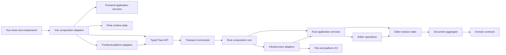

# Architecture

Simple Table is a single-document Tauri application. Rust owns the canonical
document and persistence state. Vue owns a bounded render projection and
transient interaction state.

This document records stable boundaries and ownership. Resource values,
function names, queue implementations, and response layouts belong to code and
tests; they are intentionally not duplicated here.

## Dependency Direction

Dependencies point inward. Composition roots and adapters may know concrete
implementations; application and domain code depend on semantic ports and
internal models.

## Frontend Boundaries

### Protocol and runtime models

- `src/types/generated.ts` is generated from Rust and is reachable only through
  `src/types/protocol.ts`.
- `src/types/*Runtime.ts` contains frontend-owned state contracts. Runtime
  models do not depend on generated declarations.
- `src/application/*Protocol.ts` maps transport responses into runtime state.
  Stores and feature components do not retain transport DTOs.
- Decimal `u64` identifiers remain strings in JavaScript and are compared with
  `BigInt`, never `number`.

### Application and state

- `src/application/` is framework-independent. It may not import Vue, Pinia,
  Element Plus, router, platform modules, Tauri, or backend API adapters.
- Application services own workflow policy, serialization, cancellation,
  recovery, and lifecycle coordination through injected ports.
- Pinia Stores own serializable view state and synchronous transitions. They do
  not perform I/O, schedule work, or locate other services.
- `DocumentWorkspaceRuntime` owns the document session, region cache, pending
  saves, search session, command bus, preparation cleanup journal, and admitted
  document work. Its cancellation signal terminates frontend result observation
  when the workspace is disposed; it never repeats or reclassifies the backend
  side effect.
- `ApplicationWorkspaceRuntime` owns application exit, document workspace,
  recent files, updates, and startup restoration. Disposal closes admission,
  cancels result observation that cannot outlive the workspace, and drains the
  remaining accepted work.

### Adapters and UI

- `src/platform/` owns platform-specific Tauri APIs: operating-system selection,
  file operations, window operations, update transport, and document-launch
  events.
- `src/api.ts` and `src/tauriInvoke.ts` form the typed IPC adapter;
  `tauriInvoke.ts` is the only non-platform module that imports Tauri. Components
  and views never call them directly.
- `src/composables/` binds application ports to Pinia, router, platform, API,
  and presentation services. A composable does not reimplement application
  workflow state.
- Vue components consume semantic props, Stores, or composable facades. They do
  not import platform modules or Tauri APIs.

## Backend Boundaries

### Domain and aggregate

- `domain/` owns editor commands, applied operations, cell values, search work,
  and other serialization-independent contracts.
- `document_data.rs` owns canonical editable content. It has no serde, Tauri,
  TypeScript-generation, or workbook-library behavior.
- `SpreadsheetDocument` is the physical document aggregate. It keeps canonical
  projection, formula state, region metadata, and workbook backing consistent
  across commit and rollback.
- `EditorState` is the session aggregate. It owns document identity, revision,
  history, dirty tracking, save leases, and resource accounting.
- Aggregate size alone is not a design defect. Code is split only when a
  responsibility can move without exposing mutable state or weakening a
  transaction invariant.

### Application, operations, and state

- `application/` coordinates use cases and semantic ports. It cannot depend on
  commands, adapters, I/O, recent-file infrastructure, Tauri, Tantivy, or wire
  DTOs.
- `ops/` implements editor operations over the active document repository and
  returns internal mutation outcomes. It does not construct protocol responses.
- `state/` owns the active document repository and per-document handle. The
  repository lock is not exposed; callers request read or mutation handles.
- Replacement and close retire old document handles and derived runtime work
  before old state is released.

### Transport and infrastructure

- `commands/` contains thin Tauri adapters. Commands validate bounded wire
  input, select a narrow runtime service and executor, and project the internal
  result to a response.
- `runtime.rs` is the Rust composition root. It is the only place that assembles
  repositories, application services, platform adapters, search runtime, and
  shared budgets.
- `types/` owns wire DTOs. `projection_model/` owns serialization-independent
  application results. `protocol_projection/` is the outward mapper between
  them.
- `io/` owns codecs, filesystem behavior, platform file access, and persistence
  primitives. It cannot call application, command, operation, state, recent, or
  protocol layers.
- `adapters/` owns infrastructure implementations of application ports.
  `search_index_backend.rs` is the only module allowed to depend on Tantivy and
  its tokenizer integration. The index registry, worker, scheduler, and query
  engine consume opaque backend contracts.

## State Ownership

- Rust document content is authoritative. The frontend projection is replaceable
  and may be marked stale after a revision gap or patch failure.
- `documentSession` owns the manifest and loaded sheet slots.
  `DocumentRegionCache` owns bounded resident blocks, recency, pins, and
  eviction. Eviction cannot alter stable sheet geometry.
- `pendingCellSaves` owns drafts not yet committed to Rust. Unsaved state is the
  Rust dirty flag OR pending frontend content.
- Selection, search results, dialogs, and viewport state are UI-only and never
  affect document dirty tracking.
- Derived search indexes never live in `EditorState`. `SearchIndexRuntime` owns
  their workers, freshness, residency, cancellation, and shutdown.
- Process state is instance-owned by a composition root. Business repositories,
  schedulers, and executors do not locate mutable global singletons.

## Core Workflows

### Open and replacement

1. A platform adapter authorizes or imports a source.
2. The Rust open service reserves work, preflights the format, and prepares an
   `EditorState` without replacing the active document.
   Preparation IDs have bounded, expiring success, failure, and cancellation
   state so retries cannot consume a cancellation or install a late result.
3. The frontend admits the bounded preview and commits the prepared token with
   the expected document context.
4. Rust atomically replaces the document, retires old replay/index work, and
   schedules the new indexes.
5. Launch-target claims are acknowledged only after route loading succeeds and
   are released on cancellation or failure.

### Mutation

1. Pending cell edits are flushed when the next operation requires committed
   data.
2. Every mutation carries document ID, base revision, and command ID.
3. Rust reserves idempotent replay, validates context, executes one aggregate
   transaction, and advances revision once for a non-no-op change.
4. Internal outcomes are projected to bounded wire patches at the command
   boundary.
5. The frontend accepts only the expected next revision. Unsafe or unsupported
   deltas trigger a bounded projection refresh.

### Save

1. Rust validates the target and captures an immutable save snapshot under the
   current revision.
2. Encoding and staged I/O occur outside the document lock under a shared work
   budget.
3. A save lease prevents mutation between final validation, durable write, and
   saved-hash commit.
4. Failed staging or writing aborts the lease. Successful save refreshes identity,
   dirty state, capabilities, and derived search work.

### Search

1. `SearchService` consumes only a query port.
2. The outer search adapter uses a fresh bounded index when available.
3. Missing, stale, or failed indexes fall back to a bounded authoritative scan.
4. Search results use internal retention limits; exact serialized response
   admission occurs only at protocol projection.

## Architecture Enforcement

`npm run test:architecture` parses TypeScript, Vue, and Rust production imports
into dependency graphs. It enforces:

- no production dependency cycles;
- inward-only application, domain, Store, document, operation, and I/O layers;
- generated protocol and runtime-model separation;
- Tauri and Tantivy infrastructure ownership;
- command, protocol-projection, and search-infrastructure module ownership.

The architecture test deliberately does not inspect function names, local
variables, source ordering, numeric constants, or expected call snippets. Those
are implementation details, not dependency boundaries.

Behavioral guarantees are tested beside their owners:

- transaction commit and rollback;
- idempotency and stale-context rejection;
- resource admission and bounded responses;
- cancellation, disposal, and worker shutdown;
- save durability and document replacement;
- platform launch claims and application exit.

An architectural issue is complete when the dependency violation is removed,
the relevant behavior is tested, and a stable graph rule prevents recurrence.
Large files, naming preferences, and hypothetical future abstractions are not
open architecture defects by themselves.
