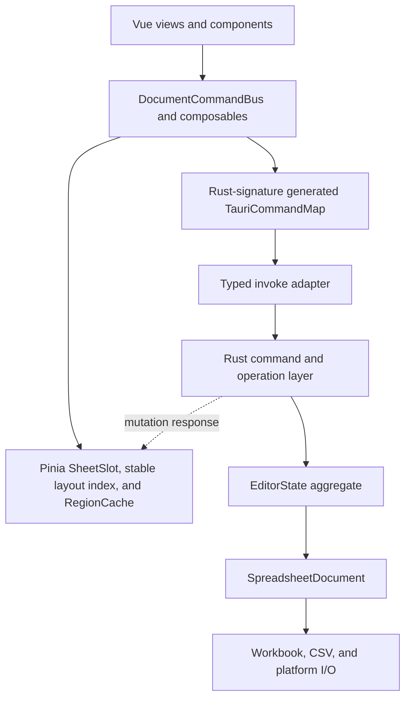

# Architecture

Simple Table is a single-document Tauri application. Rust owns the canonical
document; Vue owns a renderable projection and transient UI state.

## Component Boundaries



Frontend platform adapters select desktop, Android, or iOS file operations.
Business mutations remain platform-independent and go through the common Rust
operation layer.

## State Ownership

- `EditorState` is authoritative for content, revision, history, dirty state,
  formula state, capabilities, and search indexes.
- The active-document registry owns only the current `Arc<DocumentHandle>` and
  replacement lease. Each handle owns a separate `RwLock<EditorState>`, so a
  mutation or projection releases the registry lock before accessing document
  content. Closing and replacement retire the old handle under its content
  lock; work that cloned it earlier is rejected before it can read or commit.
- `SpreadsheetDocument` keeps the UI `FileData` projection consistent with the
  persistence body. XLSX documents retain the original workbook so supported
  edits preserve metadata that is only projected read-only.
- `documentSession` stores a `DocumentProjection` made of explicit `SheetSlot`
  values. Every Sheet owns a stable sparse layout index from its manifest.
  Loaded Sheets additionally own bounded cell blocks and render-only metadata.
  Cell-block eviction cannot change row or column geometry.
- `pendingCellSaves` owns drafts that have not reached Rust. The unsaved marker
  is the backend dirty flag OR pending frontend content.
- Selection and search result state are UI-only and must not influence document
  dirty tracking.

## Mutation Protocol

Every document mutation carries `{ documentId, baseRevision, commandId }`.

Both values are Rust `u64` internally and decimal strings on the IPC boundary.
The frontend compares them with `BigInt`; they must never be converted through
JavaScript `number`.

1. Pending cell edits are flushed before commands that depend on committed data.
2. The frontend serializes document mutations.
3. Rust rejects a command if the active document or revision changed.
4. Rust applies the operation transactionally, updates history and dirty state,
   and advances the revision exactly once for a non-no-op mutation.
5. Rust returns status plus protocol-v4 projection patches. Structural row and
   column patches carry coordinate changes that also shift the frontend's sparse
   layout overrides. Routine mutations never return complete layout maps or
   complete Sheets; a history restore whose direction cannot be represented
   safely requests a projection resync.
6. The frontend applies only the next revision. A gap, duplicate revision with
   patches, unsupported protocol, or patch failure marks the projection stale.
7. Successful responses are retained in a bounded replay journal. Retrying the
   same `commandId` returns the result without reapplying the mutation. Ambiguous
   IPC results are queried through `get_mutation_result`.
8. A stale projection is locked and replaced from
   `get_current_document_projection`, which returns a manifest and one bounded
   preferred-Sheet region, before editing resumes.

Cell patches are capped at 4,096 changes and an estimated 2 MiB per response.
Larger recalculations are represented as per-Sheet invalidations. Formula status
exposes complete counts but at most 100 diagnostic samples per response.
The complete serialized mutation response is capped at 3 MiB. Size counting and
oversized-response replacement with `ResyncRequired` happen at the replay
boundary after the document lock is released and before the response is stored
or returned through IPC.

Oversized replay responses are stored as compact `ResyncRequired` results at the
committed revision, preserving idempotency without retaining a second large body.
Request fingerprints are streamed into fixed-size SHA-256 digests, so replay
entries never retain serialized mutation payloads. The replay coordinator lock
protects only reservation and queue accounting; mutation execution, response
serialization, and response cloning happen outside it. A concurrent retry waits
only for the same `{ documentId, commandId }`. Result lookup returns
`pending`, `completed`, or `missing` immediately; the frontend polls `pending`
with exponential backoff and a three-second deadline. Closing or replacing a
document marks its replay state retired and returns without waiting. The last
in-flight reservation discards its late response and removes the retirement
marker. At most 64 distinct mutation commands may be in flight, preventing the
coordinator queue from becoming an unbounded admission path ahead of the
document lock. Tauri mutation commands
run on a dedicated blocking executor with one execution slot and eight total
admission slots. Saturated admission fails immediately instead of retaining an
unbounded set of IPC requests. `set_cells` accepts at most 4,096 changes and
enforces that limit while deserializing the sequence. Cell text is limited during
command deserialization to 4 MiB per cell and 8 MiB per batch. The frontend
drains pending cell saves with the same count and byte limits without copying its
complete queue. Active and queued requests are limited to 8,192 changes and
16 MiB of UTF-8 text in total; input that exceeds the hard budget is rejected
before it can replace an accepted draft.

Search scheduling metadata is internal to Rust and must not be serialized in
`EditorMutationResponse`.

Formula parsing has a separate complexity boundary from ordinary cell text.
Formula source is limited to 64 KiB, delimiter nesting to 128 levels, parsed
syntax to 4,096 nodes, and precise dependency tracking to 1,024 references per
formula. The AST cache has an 8 MiB byte budget, formula runtime source work is
rejected before third-party workbook construction above an estimated 64 MiB,
and the precise dependency index has a 32 MiB logical budget. Formulas whose
dependencies exceed the precise-tracking limits remain registered but fall
back to recalculation after every edit. Dependency removal uses reverse edges
and batches range-bucket rebuilds once per mutation batch. Diagnostic counts
remain complete while only 100 issue samples are retained internally.

Formula evaluation also has a per-mutation admission budget, separate from its
memory budgets. Before a transaction captures rollback state or changes the
document, Rust estimates the affected formula set, including fallback formulas,
new formulas in the request, and all formulas rebuilt by structural edits. A
mutation may evaluate at most 16,384 formulas and process at most 8 MiB of
formula source. An oversized calculation is rejected atomically without
changing revision, dirty state, or history; synchronous third-party evaluation
is never interrupted after a transaction starts.

`DocumentCommandBus` owns interactive and background mutation sequencing,
pending-edit flushes, response application, stale-projection recovery, and
post-mutation callbacks. Components and feature composables should call it
instead of rebuilding the mutation lifecycle.

## RPC Contract

Rust `ts-rs` declarations and the `TauriCommandMap` are emitted together into
`src/types/generated.ts`. The command map generator parses the actual
`#[tauri::command]` Rust signatures, including argument naming and return types.
`invokeCommand` is the only direct wrapper around Tauri `invoke` in application
code; command names, arguments, and results are checked against that map.

Wire-level integer identifiers use the generated `` `${bigint}` `` type. The
invoke adapter validates canonical decimal form and the Rust command boundary
rejects JSON numbers. Revisions use checked increments and can never wrap.

Creating a blank document is a zero-argument backend command. Rust owns the
default file format, Sheet name, dimensions, and initial cells; the frontend
cannot submit a complete `FileData` aggregate through the new-document RPC.

## Document Replacement And Save

Opening uses a prepare/commit/abort protocol. Preparing parses into a temporary
`EditorState` without replacing the active document. Commit validates the
expected active document and revision before replacement.

Prepared commit checks out the prepared entry and acquires a backend document
replacement lease while holding the registry lock only briefly. The registry
lock is released before a mobile transient file is promoted into the managed
catalog. While the lease is active, mutation, save commit, close, and another
replacement are rejected, but consistent reads of the old document remain
available. The lease then atomically installs the prepared `EditorState`.
Failed promotion restores the prepared token, and the checkout continues to
reserve prepared-document capacity until replacement finishes.

Closing and replacement detach the previous `EditorState` while holding the
registry lock, then cancel its index and replay work and release the detached
state after the lock is dropped. Save rebinding similarly returns the old
workbook and any cleared history as retired resources for lock-external release.
The close command runs on the mutation executor, so large document destruction
does not run on the synchronous command path.

Prepared documents are process-local, limited to one entry and an estimated
128 MiB, and expire after five minutes. A second prepare is rejected while a
live token exists; it never evicts the first token. The active and prepared
documents are also limited to an estimated 256 MiB combined. The estimate
includes the UI projection, retained XLSX workbook, formula runtime, metadata
index, search indexes, and history. Callers should still abort unused tokens
promptly. Before third-party parsing, a format preflight validates archive
structure and estimates parse memory from CSV input bytes or XLSX compressed
plus expanded bytes. That estimate must fit both the prepared-document and
combined active/prepared budgets; it is never clamped down to the budget. The
completed document's resident estimate is checked again after parsing. Expired,
aborted, or rejected prepared states are detached under the prepared-store lock
and released after the lock is dropped. Explicit abort runs on the bounded
blocking executor. Route cancellation must keep the loading lifecycle reserved
until the in-flight prepare settles.

Saving follows this order:

1. Flush frontend drafts and wait for queued mutations.
2. Capture a backend save snapshot for the current revision.
3. Acquire a save commit lease.
4. Write the target atomically.
5. Finish the lease, update identity if needed, advance revision, and mark the
   content hash as saved.

Closing or replacing an active document while a save lease is held is invalid.
Save and export snapshot generation has a process-wide RAII work reservation
that starts before the projection can be cloned and remains held through the
temporary write, reparse, and commit or export write. Only one such job may run
at a time, its estimated source is capped at 256 MiB, and XLSX/CSV writers use a
limited output buffer capped at 192 MiB.

## Resource Boundaries

Opening returns a `DocumentManifest` with stable sparse row and column layout
overrides, plus only the first bounded cell region. Selecting a deferred Sheet
and scrolling load aligned tiles through `get_sheet_region_projection` for the
exact revision. Cell values, merges, formats, and styles are tile-scoped. Merge
anchors outside an intersecting tile are returned separately. The grid renders
the visible region plus overscan and refuses to edit an unloaded cell.

The frontend retains at most four resident Sheet slots, eight blocks per Sheet,
24 blocks overall, and approximately 16 MiB of block payload. `RegionCache`
uses access LRU, pins at most eight visible tiles, shares in-flight promises,
rejects previous document generations, and runs at most four projection
requests concurrently. Active and queued loads for the current generation are
limited to 16. A new viewport generation removes queued tiles that no longer
cover the visible area, while explicit Sheet loads and search-result navigation
can evict queued viewport work. The initial region is a normal 128 x 32 tile and
participates in the same LRU and byte budget. Rust caps each serialized region
response at 16 MiB and reports its measured size; the frontend rejects blocks
above that contract, subdivides only the dedicated oversized-region error, and
treats multiple child blocks as combined coverage. The ordinary cache target is
16 MiB; pinned visible blocks form a separate hard bound of eight 16 MiB blocks
so visibility cannot turn the cache into an unbounded exception.

Each loaded Sheet also owns an aggregated region-metadata snapshot. It is rebuilt
only when its resident block membership changes; cell-only patches retain the
same merge, format, and style snapshot. Rendering therefore does not repeatedly
copy all block metadata after ordinary edits.

Grid geometry is sparse as well as cell data. Each axis stores its default size,
sorted explicit overrides, and prefix size deltas. Offset lookup, pixel-to-index
lookup, visible-item discovery, merged spans, and resize handles do not allocate
an entry per logical row or column. Resize previews are a small transient
override layer, and column labels are generated only for visible columns.
Loaded merge ranges use a balanced row interval index. Every range is stored a
constant number of times regardless of its row span, and point or viewport
queries apply column filtering only to row-intersecting candidates.

An oversized logical tile may be subdivided, but subdivision has its own
admission boundary: at most 64 fragment requests, 32 MiB of combined fragment
payload, and ten seconds may be spent on one logical load. Every recursive step
checks the document and viewport generation before issuing another IPC request.
Responses are converted to cache blocks as they arrive, so the loader does not
retain both complete response objects and their mapped blocks. Resetting the
document generation stops further recursive requests from an obsolete load.

Region commands capture detached cells, metadata, manifest values, document ID,
and revision while holding the document read lock, then release the lock before
exact JSON size counting. Size counting uses a non-allocating writer and runs on
a dedicated blocking executor with two execution slots and eight total admission
slots. Region loading therefore cannot retain the global document lock while
serializing a response or create an unbounded IPC work queue. Prepared-document
commit is serialized with document mutations; its initial projection is likewise
finalized only after the registry write lock is released.

Formats and styles are indexed into the same 128 x 32 tile geometry, while
merges use a row interval tree. Region projection therefore examines only
intersecting buckets and intervals. Structural commits and history restores
rebuild the index at the transaction boundary.

Rust retains at most four Tantivy indexes and 64 MiB of measured resident index
memory. Each index accounts for its live RAM-directory files, writer arena, and
index structure rather than a fixed per-index estimate. Incremental commits
recheck the byte budget and evict the oldest resident index when necessary.
Search fallback scans through a cursor with chunks capped at 8 MiB of generated
text and 32,768 visited cells. Each chunk is copied while holding only the
document read lock and is consumed before the next chunk, so fallback never
retains both a complete Sheet snapshot and a complete search-text snapshot. A
process-wide 24 MiB reservation covers fallback scan memory. Search commands run
on a dedicated blocking executor with one execution slot and two admission
slots, so a long scan cannot consume file-open or save capacity. A fallback
queues one missing Sheet index per search so repeated searches converge to
indexed execution without flooding the resident cache. Layout overrides are
limited to 100,000 entries per document.

Search queries are limited to 4 KiB of UTF-8 text and 64 unique normalized
terms before document access. Query construction uses set-based deduplication,
and scan matching uses set membership rather than nested term comparisons.
Search results contain at most 512 bytes of UTF-8 text around the match, and the
complete serialized response is limited to 2 MiB as well as 1,000 results. The
response reports whether either limit truncated the result set, so full cell
text is never copied through IPC solely for list rendering.

Pending search-index work has a separate scheduler budget because it lives
outside `EditorState`: at most 256 pending Sheets, 4,096 incremental updates or
8 MiB per Sheet, and 16 MiB across the scheduler. Each pending Sheet and the
global scheduler maintain constant-time byte counters. Crossing an update or
byte limit discards that Sheet's queued text copies and replaces them with one
full rebuild at the latest search-index stamp. Dropping a new Sheet at the
global Sheet limit remains correct because search uses the current projection
scan until an on-demand rebuild can be admitted.

Index builds have an independent 64 MiB reservation budget covering the writer
arena and a conservative multiple of the source Sheet estimate. The reservation
is acquired before cloning search text and released after installation,
cancellation, or failure. Sheets estimated above 12 MiB are not indexed and
continue using the correct scan fallback. Scheduler statistics expose pending
and building bytes separately. Index replacement, byte-budget eviction,
truncation, and oversized-index rejection return detached indexes so Tantivy
resources are released only after the document registry write lock is dropped.

Undo and redo history uses deque storage. Clearing redo after a new edit and
evicting old entries at the count or 64 MiB byte limit detach mementos from the
history store and return them with the mutation result. The operation layer
builds the consistent response under the document lock, then releases detached
history resources after leaving the registry critical section.

Parsing, file dialogs, save/export generation and I/O, mobile file work, search,
and file metadata reads run through a blocking command executor with two
execution permits and eight total admission permits. Recent-file transactions
and thumbnail encoding use a separate executor with one execution permit and
three total admission permits, so rebuildable metadata cannot exhaust critical
file-command admission. Tauri async runtime threads do not perform those
synchronous workloads directly, and saturation cannot create an unbounded
semaphore wait queue.

Frontend recent-file updates use a latest-only worker shared by all composable
instances. At most one update is active and one latest request is pending;
superseded updates do not regenerate thumbnails or refresh the list. Persisted
recent metadata accepts at most 1,024 records and 4 MiB of logical text, with
separate limits for identifiers, paths, names, and thumbnails. Both decoded
store data and mobile catalog reconciliation are validated before IPC output.

Desktop open and save selections are one-shot path capabilities, not permanent
process permissions. Open and save registries are independently limited to 64
entries, authorizations expire after 30 minutes, and repeated authorization
refreshes the eviction order. Preparing or saving consumes the capability;
canceling the picker flow revokes it explicitly.

Frontend route-driven opening is a latest-only worker. At most one file load is
active and one pending route is retained; a newer route cancels the active
continuation and replaces the pending route instead of extending a Promise
chain.

Mobile imported selections and reserved save locations are likewise one-shot.
Their registries are independently limited to 64 entries per purpose and expire
after 30 minutes. Registration writes a small hashed sidecar marker beside the
managed file. Successful document adoption atomically creates a separate managed
document sidecar before removing the transient marker. The managed sidecar is the
durable ownership catalog; recent-file metadata and thumbnail generation are
rebuildable secondary data and are not required to retain a mobile document.
Startup removes stale transient markers for cataloged documents before applying
transient expiry, and promotes non-empty interrupted save-location files into the
managed catalog. Discard and transient expiry remove only files that have not
been promoted.

Mobile catalog recovery is a synchronous, process-once initialization barrier.
All mobile file commands share its cached result, so ordinary directory access
does not repeat startup repair and no command can race ahead of reconciliation.
Persistent sidecar reads are capped at 16 KiB per marker, fields at 1,024 bytes,
and a storage directory scan at 1,024 entries. Invalid or oversized catalog
markers are removed where ownership can be determined safely; exceeding the
directory admission limit fails initialization instead of performing unbounded
startup work.

New mobile adoptions are limited to 64 managed documents and 1 GiB of managed
file bytes. Existing documents from older versions are migrated without silent
deletion, after which the quota blocks additional adoption until the user removes
documents. The home file list is reconciled from managed sidecars when recent
metadata is missing or corrupt. Only the ten most recent managed entries retain
embedded thumbnail data. Deleting a mobile entry removes the file and managed
sidecar before removing its rebuildable recent metadata, and an active document
cannot be deleted through this path.

Mobile update checks use one process-wide request slot and a shared HTTP client
with a ten-second connect timeout and twenty-second total timeout. The GitHub
release body is streamed under a 256 KiB limit, release and current versions are
parsed as strict SemVer, and only APK links under this repository's GitHub
release-download path are exposed. Update failures use the same serialized
`AppError` contract as other commands. An application-scoped Pinia update
session owns update state, the in-flight check, and the desktop download task.
Checks and downloads therefore remain single across route component remounts.
Dialogs only subscribe to that session, and resetting dialog state cannot
interrupt an active download or discard its progress.

`ResourceLedger` caches per-Sheet resource usage and extents. Ordinary edits
validate against cached workbook totals and refresh only affected Sheets,
instead of scanning the entire workbook for every mutation.

Rust still owns the complete workbook and computes mutations, dirty hashing,
formula recalculation, undo/redo, and search across all Sheets. No command
returns the complete frontend document projection. History, prepared bytes,
layout entries, replay bytes, region size, response size, resident Sheets,
region blocks, block bytes, diagnostics, indexes, and request concurrency are
correctness constraints.

Revision capacity is checked before document, history, dirty, or save state is
changed. Document, save-lease, and search-generation identifiers use nonzero
random `u64` values rather than wrapping counters.

## Verification

Contract changes require both generated TypeScript and Rust serialization tests.
Run the following command to intentionally update the generated contract, then
run the normal frontend and Rust test suites.

```bash
UPDATE_GENERATED_TYPES=1 cargo test \
  types::typescript::tests::generated_typescript_contract_is_current -- --exact
```
