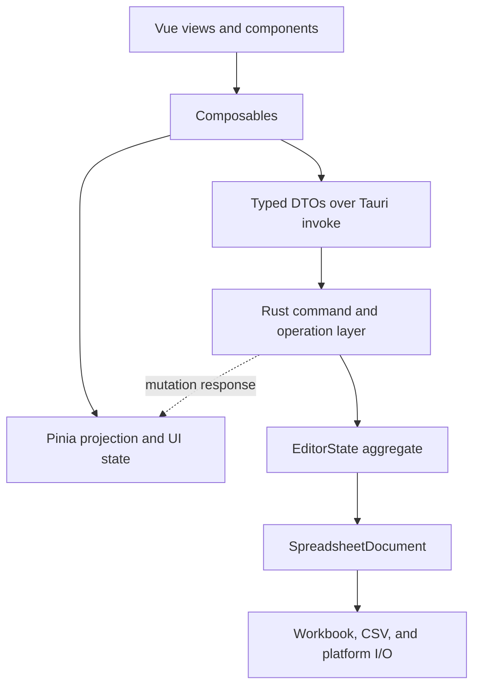

# Architecture

Simple Table is a single-document Tauri application. Rust owns the canonical
document; Vue owns a renderable projection and transient UI state.

## Component Boundaries



Frontend platform adapters select desktop, Android, or iOS file operations.
Business mutations remain platform-independent and go through the common Rust
operation layer.

## State Ownership

- `EditorState` is authoritative for content, revision, history, dirty state,
  formula state, capabilities, and search snapshots.
- `SpreadsheetDocument` keeps the UI `FileData` projection consistent with the
  persistence body. XLSX documents retain the original workbook so supported
  edits preserve metadata that is only projected read-only.
- `documentSession` stores the frontend copy of `FileData`, the current
  `documentId`, and the last applied revision.
- `pendingCellSaves` owns drafts that have not reached Rust. The unsaved marker
  is the backend dirty flag OR pending frontend content.
- Selection and search result state are UI-only and must not influence document
  dirty tracking.

## Mutation Protocol

Every document command carries `{ documentId, baseRevision }`.

1. Pending cell edits are flushed before commands that depend on committed data.
2. The frontend serializes document mutations.
3. Rust rejects a command if the active document or revision changed.
4. Rust applies the operation transactionally, updates history and dirty state,
   and advances the revision exactly once for a non-no-op mutation.
5. Rust returns status plus projection patches.
6. The frontend applies only the next revision. A gap, duplicate revision with
   patches, unsupported protocol, or patch failure marks the projection stale.
7. A stale projection is locked and replaced from `get_current_file_data`
   before editing resumes.

Search scheduling metadata is internal to Rust and must not be serialized in
`EditorMutationResponse`.

## Document Replacement And Save

Opening uses a prepare/commit/abort protocol. Preparing parses into a temporary
`EditorState` without replacing the active document. Commit validates the
expected active document and revision before replacement.

Prepared documents are process-local, limited to two entries, and expire after
five minutes. Callers should still abort unused tokens promptly.

Saving follows this order:

1. Flush frontend drafts and wait for queued mutations.
2. Capture a backend save snapshot for the current revision.
3. Acquire a save commit lease.
4. Write the target atomically.
5. Finish the lease, update identity if needed, advance revision, and mark the
   content hash as saved.

Closing or replacing an active document while a save lease is held is invalid.

## Resource Boundaries

Grid virtualization limits rendered DOM nodes, but `FileData` is currently a
whole-document projection in both Rust and JavaScript. Projection limits,
history limits, prepared-document limits, and bounded resident search indexes
are therefore correctness constraints, not optional optimizations.

Any future viewport or sheet paging protocol must preserve revision ordering,
dirty hashing, formula recalculation, undo/redo, and fallback resynchronization.

## Verification

Contract changes require both generated TypeScript and Rust serialization tests.
Run the following command to intentionally update the generated contract, then
run the normal frontend and Rust test suites.

```bash
UPDATE_GENERATED_TYPES=1 cargo test \
  types::typescript::tests::generated_typescript_contract_is_current -- --exact
```
