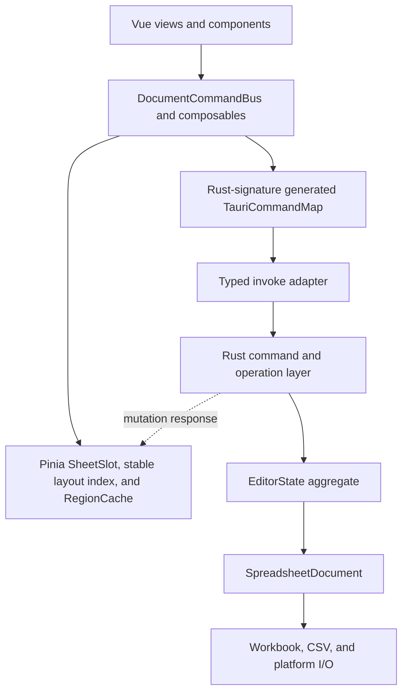

# Architecture

Simple Table is a single-document Tauri application. Rust owns the canonical
document; Vue owns a renderable projection and transient UI state.

## Component Boundaries



Frontend platform adapters select desktop, Android, or iOS file operations.
Business mutations remain platform-independent and go through the common Rust
operation layer.

## State Ownership

- `EditorState` is authoritative for content, revision, history, dirty state,
  formula state, capabilities, and search indexes.
- `SpreadsheetDocument` keeps the UI `FileData` projection consistent with the
  persistence body. XLSX documents retain the original workbook so supported
  edits preserve metadata that is only projected read-only.
- `documentSession` stores a `DocumentProjection` made of explicit `SheetSlot`
  values. Every Sheet owns a stable sparse layout index from its manifest.
  Loaded Sheets additionally own bounded cell blocks and render-only metadata.
  Cell-block eviction cannot change row or column geometry.
- `pendingCellSaves` owns drafts that have not reached Rust. The unsaved marker
  is the backend dirty flag OR pending frontend content.
- Selection and search result state are UI-only and must not influence document
  dirty tracking.

## Mutation Protocol

Every document mutation carries `{ documentId, baseRevision, commandId }`.

Both values are Rust `u64` internally and decimal strings on the IPC boundary.
The frontend compares them with `BigInt`; they must never be converted through
JavaScript `number`.

1. Pending cell edits are flushed before commands that depend on committed data.
2. The frontend serializes document mutations.
3. Rust rejects a command if the active document or revision changed.
4. Rust applies the operation transactionally, updates history and dirty state,
   and advances the revision exactly once for a non-no-op mutation.
5. Rust returns status plus protocol-v3 projection patches. Structural patches
   carry coordinate changes or invalidation markers, never complete Sheets.
6. The frontend applies only the next revision. A gap, duplicate revision with
   patches, unsupported protocol, or patch failure marks the projection stale.
7. Successful responses are retained in a bounded replay journal. Retrying the
   same `commandId` returns the result without reapplying the mutation. Ambiguous
   IPC results are queried through `get_mutation_result`.
8. A stale projection is locked and replaced from
   `get_current_document_projection`, which returns a manifest and one bounded
   preferred-Sheet region, before editing resumes.

Cell patches are capped at 4,096 changes and an estimated 2 MiB per response.
Larger recalculations are represented as per-Sheet invalidations. Formula status
exposes complete counts but at most 100 diagnostic samples per response.

Oversized replay responses are stored as compact `ResyncRequired` results at the
committed revision, preserving idempotency without retaining a second large body.
Request fingerprints are streamed into fixed-size SHA-256 digests, so replay
entries never retain serialized mutation payloads. The replay coordinator lock
protects only reservation and queue accounting; mutation execution, response
serialization, and response cloning happen outside it. A concurrent retry waits
only for the same `{ documentId, commandId }`, and result lookup or document
cleanup waits only for relevant in-flight work. At most 64 distinct mutation
commands may be in flight, preventing the coordinator queue from becoming an
unbounded admission path ahead of the document lock. Tauri mutation commands
run on a dedicated blocking executor with one execution slot and eight total
admission slots. Saturated admission fails immediately instead of retaining an
unbounded set of IPC requests. `set_cells` accepts at most 4,096 changes and
enforces that limit while deserializing the sequence. The frontend drains pending
cell saves in matching bounded batches.

Search scheduling metadata is internal to Rust and must not be serialized in
`EditorMutationResponse`.

`DocumentCommandBus` owns interactive and background mutation sequencing,
pending-edit flushes, response application, stale-projection recovery, and
post-mutation callbacks. Components and feature composables should call it
instead of rebuilding the mutation lifecycle.

## RPC Contract

Rust `ts-rs` declarations and the `TauriCommandMap` are emitted together into
`src/types/generated.ts`. The command map generator parses the actual
`#[tauri::command]` Rust signatures, including argument naming and return types.
`invokeCommand` is the only direct wrapper around Tauri `invoke` in application
code; command names, arguments, and results are checked against that map.

Wire-level integer identifiers use the generated `` `${bigint}` `` type. The
invoke adapter validates canonical decimal form and the Rust command boundary
rejects JSON numbers. Revisions use checked increments and can never wrap.

Creating a blank document is a zero-argument backend command. Rust owns the
default file format, Sheet name, dimensions, and initial cells; the frontend
cannot submit a complete `FileData` aggregate through the new-document RPC.

## Document Replacement And Save

Opening uses a prepare/commit/abort protocol. Preparing parses into a temporary
`EditorState` without replacing the active document. Commit validates the
expected active document and revision before replacement.

Prepared documents are process-local, limited to one entry and an estimated
128 MiB, and expire after five minutes. A second prepare is rejected while a
live token exists; it never evicts the first token. The active and prepared
documents are also limited to an estimated 256 MiB combined. The estimate
includes the UI projection, retained XLSX workbook, formula runtime, metadata
index, search indexes, and history. Callers should still abort unused tokens
promptly. A prepare reserves the single parse slot and a conservative share of
the combined budget before parsing, then rechecks the completed document's
resident estimate. Route cancellation must keep the loading lifecycle reserved
until the in-flight prepare settles.

Saving follows this order:

1. Flush frontend drafts and wait for queued mutations.
2. Capture a backend save snapshot for the current revision.
3. Acquire a save commit lease.
4. Write the target atomically.
5. Finish the lease, update identity if needed, advance revision, and mark the
   content hash as saved.

Closing or replacing an active document while a save lease is held is invalid.

## Resource Boundaries

Opening returns a `DocumentManifest` with stable sparse row and column layout
overrides, plus only the first bounded cell region. Selecting a deferred Sheet
and scrolling load aligned tiles through `get_sheet_region_projection` for the
exact revision. Cell values, merges, formats, and styles are tile-scoped. Merge
anchors outside an intersecting tile are returned separately. The grid renders
the visible region plus overscan and refuses to edit an unloaded cell.

The frontend retains at most four resident Sheet slots, eight blocks per Sheet,
24 blocks overall, and approximately 16 MiB of block payload. `RegionCache`
uses access LRU, pins at most eight visible tiles, shares in-flight promises,
rejects previous document generations, and runs at most four projection
requests concurrently. Active and queued loads for the current generation are
limited to 16. A new viewport generation removes queued tiles that no longer
cover the visible area, while explicit Sheet loads and search-result navigation
can evict queued viewport work. The initial region is a normal 128 x 32 tile and
participates in the same LRU and byte budget. Rust caps each serialized region
response at 16 MiB and reports its measured size; the frontend rejects blocks
above that contract, subdivides only the dedicated oversized-region error, and
treats multiple child blocks as combined coverage. The ordinary cache target is
16 MiB; pinned visible blocks form a separate hard bound of eight 16 MiB blocks
so visibility cannot turn the cache into an unbounded exception.

Region commands capture detached cells, metadata, manifest values, document ID,
and revision while holding the document read lock, then release the lock before
exact JSON size counting. Size counting uses a non-allocating writer and runs on
a dedicated blocking executor with two execution slots and eight total admission
slots. Region loading therefore cannot retain the global document lock while
serializing a response or create an unbounded IPC work queue. Prepared-document
commit is serialized with document mutations; its initial projection is likewise
finalized only after the registry write lock is released.

Formats and styles are indexed into the same 128 x 32 tile geometry, while
merges use a row interval tree. Region projection therefore examines only
intersecting buckets and intervals. Structural commits and history restores
rebuild the index at the transaction boundary.

Rust retains at most four Tantivy indexes and 64 MiB of measured resident index
memory. Each index accounts for its live RAM-directory files, writer arena, and
index structure rather than a fixed per-index estimate. Incremental commits
recheck the byte budget and evict the oldest resident index when necessary.
Search fallback clones only cell values and display-affecting format/style
metadata, then scans outside the document lock. A fallback queues one missing
Sheet index per search so repeated searches converge to indexed execution
without flooding the resident cache. Layout overrides are limited to 100,000
entries per document.

Pending search-index work has a separate scheduler budget because it lives
outside `EditorState`: at most 256 pending Sheets, 4,096 incremental updates or
8 MiB per Sheet, and 16 MiB across the scheduler. Each pending Sheet and the
global scheduler maintain constant-time byte counters. Crossing an update or
byte limit discards that Sheet's queued text copies and replaces them with one
full rebuild at the latest search-index stamp. Dropping a new Sheet at the
global Sheet limit remains correct because search uses the current projection
scan until an on-demand rebuild can be admitted.

Index builds have an independent 64 MiB reservation budget covering the writer
arena and a conservative multiple of the source Sheet estimate. The reservation
is acquired before cloning search text and released after installation,
cancellation, or failure. Sheets estimated above 12 MiB are not indexed and
continue using the correct scan fallback. Scheduler statistics expose pending
and building bytes separately.

Parsing, file dialogs, save/export generation and I/O, mobile file work, search,
recent-file store transactions, file metadata reads, and thumbnail encoding run
through a blocking command executor with two execution permits and eight total
admission permits. Tauri async runtime threads do not perform those synchronous
workloads directly, and saturation cannot create an unbounded semaphore wait
queue.

Desktop open and save selections are one-shot path capabilities, not permanent
process permissions. Open and save registries are independently limited to 64
entries, authorizations expire after 30 minutes, and repeated authorization
refreshes the eviction order. Preparing or saving consumes the capability;
canceling the picker flow revokes it explicitly.

Mobile imported selections and reserved save locations are likewise one-shot.
Their registries are independently limited to 64 entries per purpose and expire
after 30 minutes. Registration writes a small hashed sidecar marker beside the
managed file. Successful document adoption atomically creates a separate managed
document sidecar before removing the transient marker. The managed sidecar is the
durable ownership catalog; recent-file metadata and thumbnail generation are
rebuildable secondary data and are not required to retain a mobile document.
Startup removes stale transient markers for cataloged documents before applying
transient expiry, and promotes non-empty interrupted save-location files into the
managed catalog. Discard and transient expiry remove only files that have not
been promoted.

New mobile adoptions are limited to 64 managed documents and 1 GiB of managed
file bytes. Existing documents from older versions are migrated without silent
deletion, after which the quota blocks additional adoption until the user removes
documents. The home file list is reconciled from managed sidecars when recent
metadata is missing or corrupt. Only the ten most recent managed entries retain
embedded thumbnail data. Deleting a mobile entry removes the file and managed
sidecar before removing its rebuildable recent metadata, and an active document
cannot be deleted through this path.

`ResourceLedger` caches per-Sheet resource usage and extents. Ordinary edits
validate against cached workbook totals and refresh only affected Sheets,
instead of scanning the entire workbook for every mutation.

Rust still owns the complete workbook and computes mutations, dirty hashing,
formula recalculation, undo/redo, and search across all Sheets. No command
returns the complete frontend document projection. History, prepared bytes,
layout entries, replay bytes, region size, response size, resident Sheets,
region blocks, block bytes, diagnostics, indexes, and request concurrency are
correctness constraints.

Revision capacity is checked before document, history, dirty, or save state is
changed. Document, save-lease, and search-generation identifiers use nonzero
random `u64` values rather than wrapping counters.

## Verification

Contract changes require both generated TypeScript and Rust serialization tests.
Run the following command to intentionally update the generated contract, then
run the normal frontend and Rust test suites.

```bash
UPDATE_GENERATED_TYPES=1 cargo test \
  types::typescript::tests::generated_typescript_contract_is_current -- --exact
```
