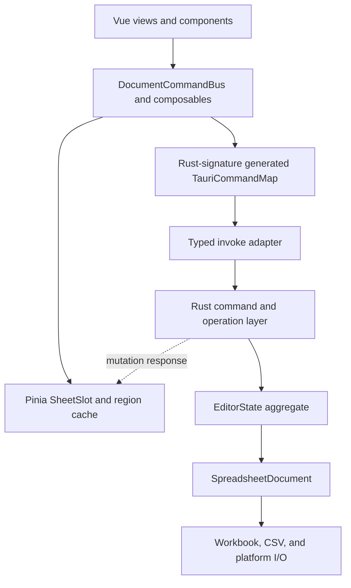

# Architecture

Simple Table is a single-document Tauri application. Rust owns the canonical
document; Vue owns a renderable projection and transient UI state.

## Component Boundaries



Frontend platform adapters select desktop, Android, or iOS file operations.
Business mutations remain platform-independent and go through the common Rust
operation layer.

## State Ownership

- `EditorState` is authoritative for content, revision, history, dirty state,
  formula state, capabilities, and search snapshots.
- `SpreadsheetDocument` keeps the UI `FileData` projection consistent with the
  persistence body. XLSX documents retain the original workbook so supported
  edits preserve metadata that is only projected read-only.
- `documentSession` stores a `DocumentProjection` made of explicit `SheetSlot`
  values. An unloaded sheet has only name and extent; a loaded sheet also has
  cell regions and metadata. Empty sheets are never used as loading sentinels.
- `pendingCellSaves` owns drafts that have not reached Rust. The unsaved marker
  is the backend dirty flag OR pending frontend content.
- Selection and search result state are UI-only and must not influence document
  dirty tracking.

## Mutation Protocol

Every document command carries `{ documentId, baseRevision }`.

Both values are Rust `u64` internally and decimal strings on the IPC boundary.
The frontend compares them with `BigInt`; they must never be converted through
JavaScript `number`.

1. Pending cell edits are flushed before commands that depend on committed data.
2. The frontend serializes document mutations.
3. Rust rejects a command if the active document or revision changed.
4. Rust applies the operation transactionally, updates history and dirty state,
   and advances the revision exactly once for a non-no-op mutation.
5. Rust returns status plus projection patches.
6. The frontend applies only the next revision. A gap, duplicate revision with
   patches, unsupported protocol, or patch failure marks the projection stale.
7. A stale projection is locked and replaced from `get_current_file_data`
   before editing resumes.

Search scheduling metadata is internal to Rust and must not be serialized in
`EditorMutationResponse`.

`DocumentCommandBus` owns interactive and background mutation sequencing,
pending-edit flushes, response application, stale-projection recovery, and
post-mutation callbacks. Components and feature composables should call it
instead of rebuilding the mutation lifecycle.

## RPC Contract

Rust `ts-rs` declarations and the `TauriCommandMap` are emitted together into
`src/types/generated.ts`. The command map generator parses the actual
`#[tauri::command]` Rust signatures, including argument naming and return types.
`invokeCommand` is the only direct wrapper around Tauri `invoke` in application
code; command names, arguments, and results are checked against that map.

Wire-level integer identifiers use the generated `` `${bigint}` `` type. The
invoke adapter validates canonical decimal form and the Rust command boundary
rejects JSON numbers. Revisions use checked increments and can never wrap.

## Document Replacement And Save

Opening uses a prepare/commit/abort protocol. Preparing parses into a temporary
`EditorState` without replacing the active document. Commit validates the
expected active document and revision before replacement.

Prepared documents are process-local, limited to two entries, and expire after
five minutes. Callers should still abort unused tokens promptly.

Saving follows this order:

1. Flush frontend drafts and wait for queued mutations.
2. Capture a backend save snapshot for the current revision.
3. Acquire a save commit lease.
4. Write the target atomically.
5. Finish the lease, update identity if needed, advance revision, and mark the
   content hash as saved.

Closing or replacing an active document while a save lease is held is invalid.

## Resource Boundaries

Opening a document returns workbook identity, sheet names and extents, but only
the first bounded cell region. Selecting a deferred sheet loads its metadata and
initial region through `get_sheet_projection`; scrolling loads additional
bounded rectangles through `get_sheet_region_projection` for the exact current
revision. The grid renders only the visible region plus overscan.

The frontend retains at most four resident Sheet slots. Rust retains at most
four persistent search snapshots/indexes; other sheets use temporary scan
snapshots when required. Full stale-state recovery is accepted on the wire but
immediately reduced to the frontend resident set.

`ResourceLedger` caches per-Sheet resource usage and extents. Ordinary edits
validate against cached workbook totals and refresh only affected Sheets,
instead of scanning the entire workbook for every mutation.

Rust still owns the complete workbook and computes mutations, dirty hashing,
formula recalculation, undo/redo, and search across all sheets. A full
`get_current_file_data` projection remains available only as stale-state
recovery. History, prepared-document, region-size, resident-Sheet, and search
budgets are correctness constraints.

## Verification

Contract changes require both generated TypeScript and Rust serialization tests.
Run the following command to intentionally update the generated contract, then
run the normal frontend and Rust test suites.

```bash
UPDATE_GENERATED_TYPES=1 cargo test \
  types::typescript::tests::generated_typescript_contract_is_current -- --exact
```
